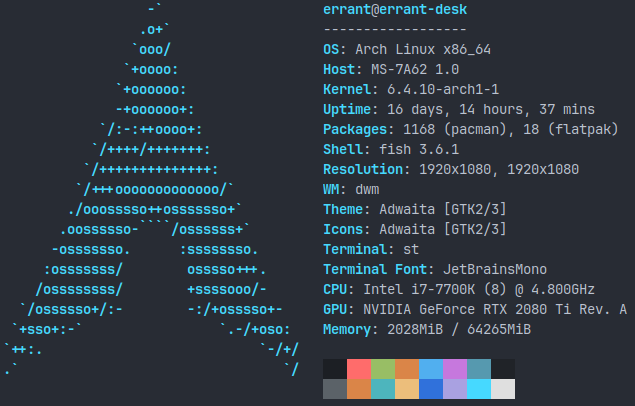

# faf-json-bench

`faf-json-bench` is a Rust JSON serialization and deserialization benchmarking tool.

Only Linux is supported.

## Why

I was looking for benchmarks and couldn't find any that included all the libraries I wanted tested.

## How to Use

You must comment out incompatible RUSTFLAGS in `./cargo/config`. There will usually only be two ("-Clinker=/usr/bin/clang-15","-Clink-arg=-fuse-ld=/usr/bin/ld.lld"). These are so I can use clang / llvm when running the test but aren't necessary to see results on the benchmark.

After that, just run it as usual with the optional flag to control duration per test. Here are some :

- While working on this, I routinely check it with `cargo run --release -- -d3`
- When actually benchmarking, I set a higher priority and run the benchmark with `sudo nice -20 ./target/release/faf-json-bench -d15` after building it with `cargo build --release`

## Libraries Tested

- [serde_json](https://github.com/serde-rs/json)
- [serde-json-core](https://github.com/rust-embedded-community/serde-json-core/)
- [nanoserde](https://github.com/not-fl3/nanoserde)
- [simd-json](https://github.com/simd-lite/simd-json)
- [simd-json-derive](https://github.com/simd-lite/simd-json-derive)

## Results

### MiMalloc Allocator

```
sonic-rs          to_vec               702,717,584 bytes/sec
sonic-rs          to_writer            900,952,293 bytes/sec
serde_json        to_vec               582,281,081 bytes/sec
serde_json        to_writer            708,082,121 bytes/sec
serde_json_core   to_vec               577,153,469 bytes/sec
serde_json_core   to_slice             613,309,651 bytes/sec
nanoserde         serialize_json       256,818,914 bytes/sec
nanoserde         ser_json             464,937,951 bytes/sec
simd_json         serde::to_vec        939,485,893 bytes/sec
simd_json         serde::to_writer   1,201,835,688 bytes/sec
simd_json_derive  json_vec             862,631,744 bytes/sec
simd_json_derive  json_write         1,286,133,949 bytes/sec
```

### SnMalloc Allocator

```
sonic-rs          to_vec               774,810,906 bytes/sec
sonic-rs          to_writer            920,956,549 bytes/sec
serde_json        to_vec               648,675,050 bytes/sec
serde_json        to_writer            716,364,451 bytes/sec
serde_json_core   to_vec               575,182,795 bytes/sec
serde_json_core   to_slice             618,356,154 bytes/sec
nanoserde         serialize_json       332,858,131 bytes/sec
nanoserde         ser_json             479,940,514 bytes/sec
simd_json         serde::to_vec      1,128,408,596 bytes/sec
simd_json         serde::to_writer   1,202,829,729 bytes/sec
simd_json_derive  json_vec             996,038,397 bytes/sec
simd_json_derive  json_write         1,281,402,158 bytes/sec
```

## Methodology

- LLVM / Clang (v15)
- MiMalloc Allocator
- Elevated priority
- Minimized system-wide noise. I always take precautions to ensure my benchmarking isn't adversely affected by other running programs by not having anything open/running, including most background services
- Compiled with flags specified in `./cargo/config`, which include `"-Ctarget-cpu=native"`-
- To ensure results aren't optimized away, I always check the output after serializing / deserializing for correctness
- To ensure, loops aren't unpredictably vectorized, I check the time on each iteration instead of doing a fixed number of iterations. My time check uses VDSO on Linux which is very fast. I thought Rust's standard library also used VDSO on Linux but when I switched to my own implementation times improved by over 10%
- Currently only testing with 'small input'

System info for context



## Why Only Linux?

Unless there is some unexpected popular demand, I only want to support what I actually use and would prefer not to add the complexity to support other platforms. Also, I often use techniques for performance reasons that are Linux specific and getting similar results on other platforms may be complex.

## Observations:

- Choice of allocator matters the most when using methods that allocate a buffer (.. yep)
- For `serde_json_core to_vec`, checking the len with `assert!(bytes_len == 26);` after the serialization actually makes the operation faster, probably because it is a compiler hint
- Cargo flags make a big difference for some frameworks like `serde_json_core`, which gained ~15% performance after adding flags to `[profile.release.package."*"]` and adding `rustflags` to `./cargo/config`. Only together does the gain appear...
- Clang is faster than gcc for some tests but not others. For example, the `serde_json to_writer` is slightly faster with gcc but both `serde-json-core` tests are much faster with Clang

## Contributions

Contributions are welcome, but please discuss before submitting a pull request. If a discussion leads to a pull request, please reference the \#issue in the pull request. Unsolicited pull requests will not be reviewed nor merged.

## License

All code is licensed under AGPL 3.0 unless an individual source file specifies otherwise.
